# Frederico Busich — CV online

Página pessoal de currículo em HTML semântico e CSS (Grid e Flexbox), responsiva e publicada em GitHub Pages.
Projeto final do módulo **Fundamentos Web** da matéria *Programação em JavaScript* — programa UPSKILL · IPCA, setembro de 2026.

**Site:** https://fredbusich.github.io/Frederico-Busich-CV/

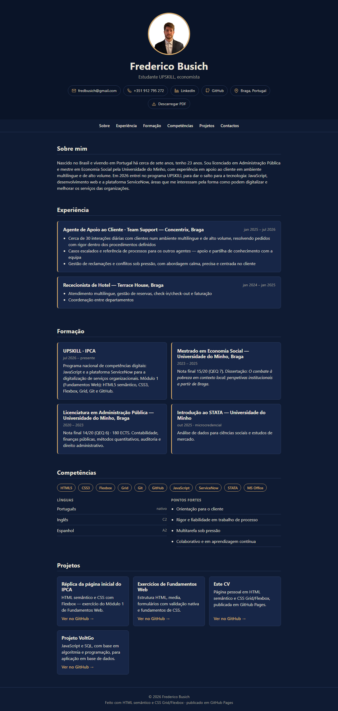

---

## Índice

1. [O projeto](#o-projeto)
2. [Como foi feito — as fases](#como-foi-feito--as-fases)
3. [Estrutura do HTML](#estrutura-do-html)
4. [Decisões de CSS](#decisões-de-css)
5. [Antes e depois](#antes-e-depois)
6. [Fluxo de trabalho com Git](#fluxo-de-trabalho-com-git)
7. [Validação](#validação)
8. [O que aprendi](#o-que-aprendi)
9. [Dificuldades e como as resolvi](#dificuldades-e-como-as-resolvi)
10. [Estrutura do repositório](#estrutura-do-repositório)
11. [Créditos](#créditos)

---

## O projeto

O objetivo era construir um CV como página web, aplicando o que foi dado no módulo: estrutura semântica em HTML5, CSS com variáveis, Flexbox, Grid e media queries, controlo de versões com Git e GitHub, e publicação em GitHub Pages.

Regras que me impus:

- **Sem frameworks nem JavaScript** — só HTML e CSS escritos à mão.
- **Planear antes de codificar** — conteúdo e esboços primeiro, código depois.
- **Uma branch por fase**, com pull request e merge para `main`, como num projeto real.
- **HTML válido** no validador do W3C em todas as versões.

---

## Como foi feito — as fases

O trabalho foi organizado em cinco fases. Cada uma teve a sua branch e o seu pull request; o `main` só recebeu código por merge.

### Fase 1 — Planeamento

- Extraí o conteúdo do meu CV em PDF para um ficheiro de texto (`conteudo.md`), já organizado por secções: sobre mim, experiência, formação, competências, línguas, projetos, contactos.
- Desenhei esboços de baixa fidelidade para desktop e telemóvel, para decidir a estrutura antes de escrever uma linha de HTML.
- A partir dos esboços, gerei um mockup visual no Google Stitch para ter uma referência de espaçamentos e hierarquia.

| Esboço desktop | Esboço mobile |
|---|---|
| 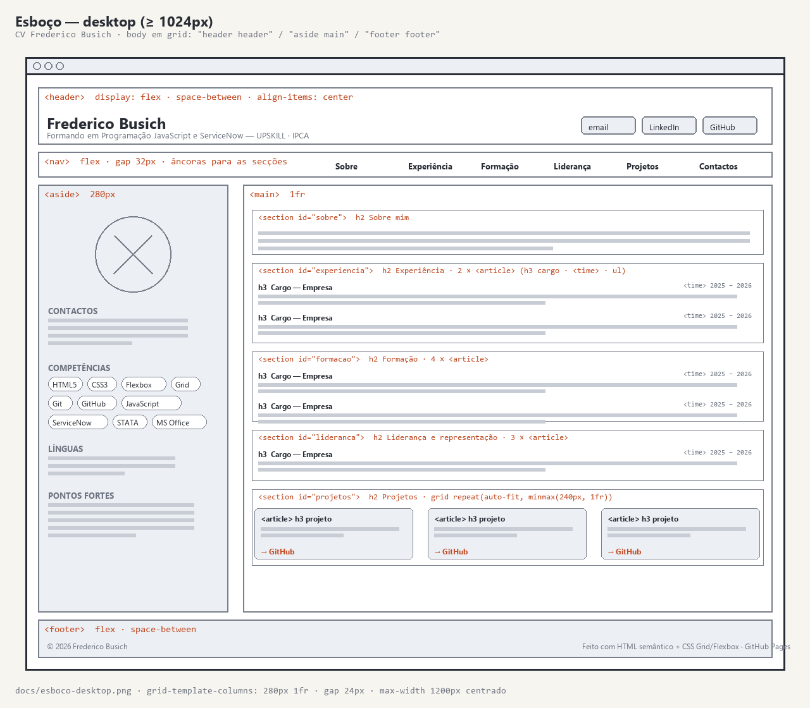 | 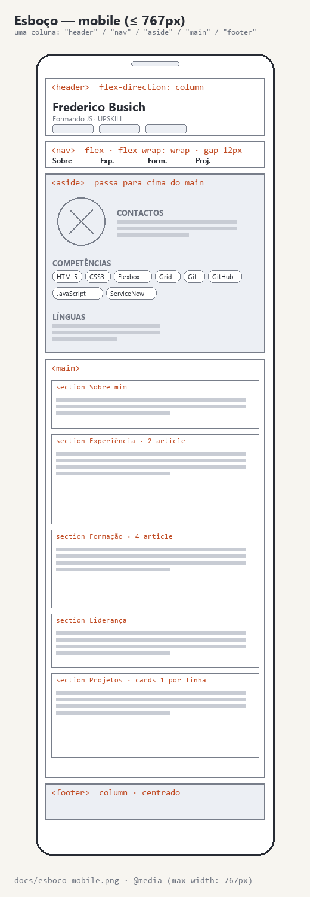 |

| Mockup desktop (Stitch) | Mockup mobile (Stitch) |
|---|---|
| 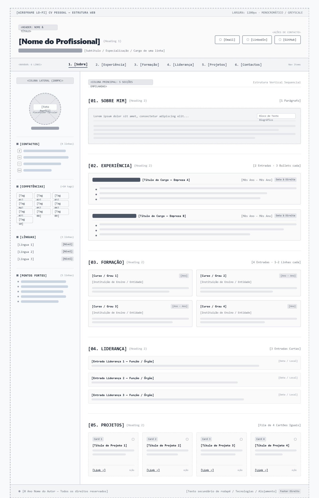 | 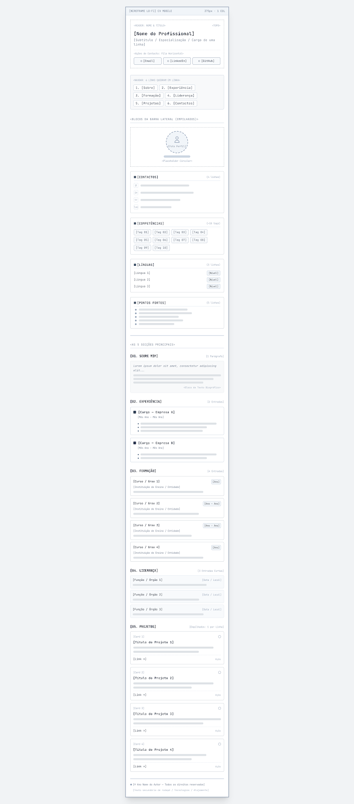 |

### Fase 2 — HTML

- Escrevi o `index.html` inteiro sem CSS, a pensar só na semântica: `header`, `nav`, `main`, `section`, `article`, `address`, `footer`, `time`.
- Menu com âncoras internas (`href="#formacao"` ↔ `id="formacao"`).
- Validei no W3C e ficou sem erros nem avisos.

### Fase 3 — CSS e publicação (versão 1)

- Variáveis em `:root` para cores e espaçamento, reset, estilos base.
- Layout da página com **CSS Grid** e `grid-template-areas` (header, nav, lateral, main, footer).
- **Flexbox** nos componentes: cabeçalho, menu, lista de contactos, pílulas de competências, cartões.
- Media query a 767px: a lateral passa para cima do conteúdo, tudo numa coluna.
- Publicação em GitHub Pages a partir da branch `main`.

### Fase 4 — Versão 2

Depois de ver a versão 1 no ar, decidi mudar a apresentação. Voltei ao planeamento antes de tocar no código:

- Comparei três paletas (marinho & bronze, marinho & gelo, papel & marinho), com o contraste de cada combinação medido, e avaliei um protótipo da nova estrutura. Decisões registadas em [`docs/planeamento-v2.md`](docs/planeamento-v2.md); esboços da estrutura final em `docs/esboco-v2-*.png`.

| Esboço v2 desktop | Esboço v2 mobile |
|---|---|
| 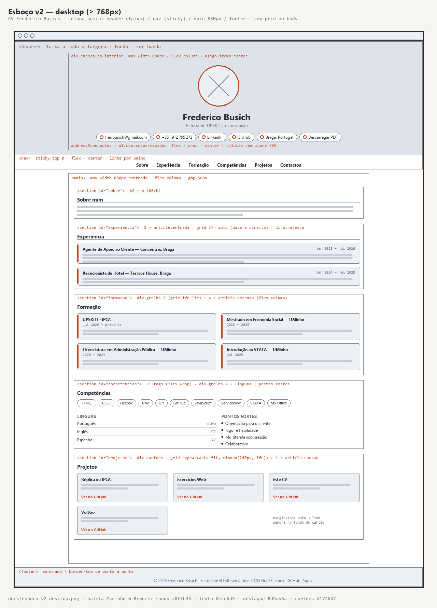 | 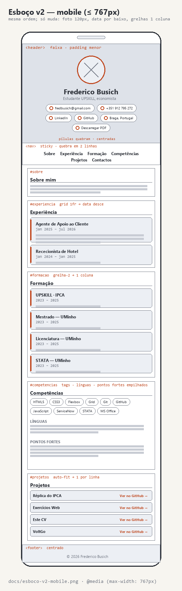 |

| Mockup v2 desktop (Stitch) | Mockup v2 mobile (Stitch) |
|---|---|
| 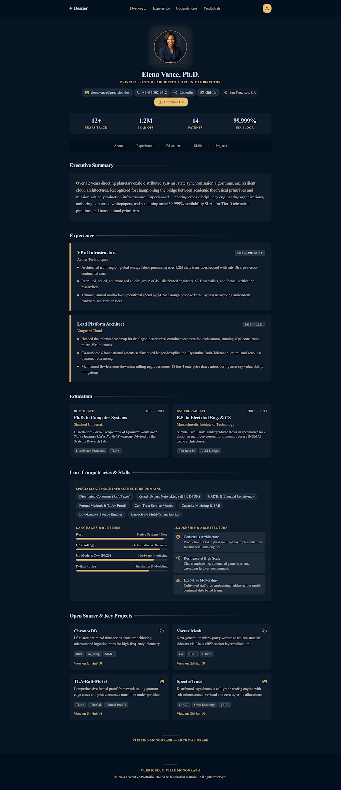 | 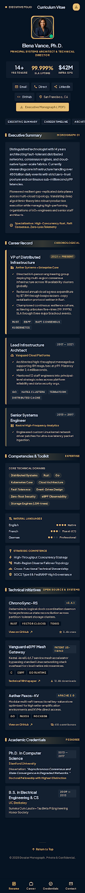 |

*Referência visual gerada a partir das decisões de planeamento — não é a versão final, que está no antes/depois.*

- **HTML:** foto e contactos passaram para o header; a lateral (`aside`) desapareceu e o seu conteúdo tornou-se a secção Competências do `main`; ícones SVG inline nas pílulas de contacto; botão para descarregar o CV em PDF; favicon; `rel="noopener"` nos links externos. Nova validação W3C.
- **CSS:** nova paleta em `:root`; o grid saiu do `body` (página em coluna única) e passou para dentro das secções — data à direita do título (`1fr auto`), formação 2×2, cartões com `auto-fit`; header centrado com Flex em coluna; menu fixo ao fazer scroll (`position: sticky`); media query refeita, mais curta que a da versão 1.
- Comentei o `style.css` linha a linha.

### Fase 5 — Relatório

- Capturas das duas versões para o antes/depois, este README, revisão final do código e entrega.

---

## Estrutura do HTML

```
body
├── header.cabecalho
│   └── div.cabecalho-interior
│       ├── img.foto
│       ├── h1 — nome
│       ├── p.subtitulo
│       └── address#contactos › ul.contactos-rapidos (email, telefone, LinkedIn, GitHub, localização, PDF)
├── nav.menu — Sobre · Experiência · Formação · Competências · Projetos · Contactos
├── main.conteudo
│   ├── section#sobre
│   ├── section#experiencia › article.entrada × 2 (com <time datetime>)
│   ├── section#formacao › div.grelha-2 › article.entrada × 4
│   ├── section#competencias › ul.tags · div.grelha-2 (ul.linguas | ul.pontos)
│   └── section#projetos › div.cartoes › article.cartao × 4
└── footer.rodape
```

Porquê estes elementos e não `div`: `article` para cada emprego, curso ou projeto (unidades que fazem sentido sozinhas), `section` para cada bloco com título, `address` para os contactos do autor, `time` com `datetime` para as datas serem legíveis por máquinas. Um único `h1`; `h2` para secções, `h3` para subsecções.

---

## Decisões de CSS

### Ordem do ficheiro

`variáveis → reset → base → layout → componentes → estados → media query`. A ordem segue a cascata: o geral primeiro, o específico depois, e a media query no fim para ganhar a tudo quando se aplica.

### Paleta em variáveis

Todas as cores estão declaradas uma vez em `:root` e usadas com `var()`. Mudar a paleta é mudar sete linhas.

| Variável | Valor | Uso | Contraste sobre o fundo |
|---|---|---|---|
| `--cor-fundo` | `#0f1b33` | página | — |
| `--cor-banda` | `#0a1428` | faixa do header | — |
| `--cor-superficie` | `#172647` | cartões | — |
| `--cor-texto` | `#ece6d9` | texto e títulos | 13,8 : 1 |
| `--cor-cinza` | `#aaa79b` | datas, níveis | 7,1 : 1 |
| `--cor-destaque` | `#d9ab6a` | links, pílulas, detalhes | 8,2 : 1 |
| `--cor-linha` | `#2b3b5f` | bordas e linhas | — |

Todos os textos ficam acima do mínimo de 4,5 : 1 (WCAG AA).

### Flexbox vs Grid

Regra que segui: **Flex para uma dimensão** (uma fila ou uma coluna), **Grid para duas** ou quando quero controlar em que coluna cada coisa cai.

| Onde | Técnica | Para quê |
|---|---|---|
| `.cabecalho-interior` | Flex, coluna | foto, nome, subtítulo e contactos centrados |
| `.contactos-rapidos`, `.menu`, `.tags` | Flex, linha com `wrap` | itens em linha que quebram no telemóvel |
| `.contactos-rapidos a` | Flex inline | ícone e texto alinhados dentro da pílula |
| `.conteudo` | Flex, coluna com `gap` | espaço regular entre secções |
| `.linguas li` | Flex, `space-between` | língua à esquerda, nível à direita |
| `#experiencia .entrada` | Grid `1fr auto` | título à esquerda, data à direita; a lista atravessa com `grid-column: 1 / -1` |
| `.grelha-2` | Grid `1fr 1fr` | formação 2×2; línguas ao lado dos pontos fortes |
| `.cartoes` | Grid `repeat(auto-fit, minmax(240px, 1fr))` | cartões que se ajustam à largura sem media query |
| `.cartao` | Flex, coluna com `margin-top: auto` | link "Ver no GitHub" sempre no fundo |

### Responsivo

Uma media query (`max-width: 767px`) muda só o que é diferente no telemóvel: título mais pequeno, foto a 120px, data por baixo do título, grelhas de duas colunas para uma, e uma margem de scroll maior porque o menu fixo ocupa duas linhas. Os cartões de projetos não precisam dela — o `auto-fit` adapta-se sozinho.

---

## Antes e depois

| Versão 1 | Versão 2 |
|---|---|
| 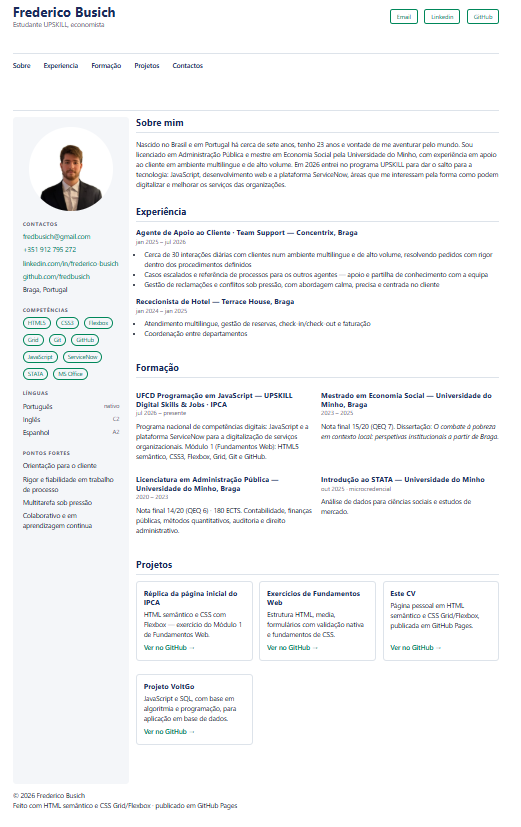 |  |

O que mudou e porquê:

- **Lateral → coluna única.** A lateral funcionava mas obrigava a um grid no `body` que no telemóvel tinha de ser refeito. Em coluna única o HTML já está pela ordem certa e o layout base é o mesmo em todos os ecrãs.
- **Cores.** Fundo claro genérico → paleta própria, com a cor de destaque (bronze) usada só onde é pouco texto.
- **Header.** Nome à esquerda e três botões → foto e nome centrados, seis pílulas com ícones (inclui telefone, localização e PDF).

---

## Fluxo de trabalho com Git

Cada fase teve a sua branch e o seu pull request: `planeamento` → `html` → `css` → `mudancas` → `readme`. O `main` só recebeu código por merge de PR, e é dele que o GitHub Pages publica.

```
git switch -c <branch>        # nova branch a partir de main
git add .                     # preparar as alterações
git commit -m "feat: ..."     # commits pequenos, mensagens no imperativo
git push origin HEAD          # subir a branch
# pull request no GitHub → ler o diff → merge
git switch main
git pull                      # main local atualizado
```

Mensagens de commit no formato *conventional commits* (`feat:`, `style:`, `docs:`, `fix:`, `chore:`).

---

## Validação

HTML validado no [Nu Html Checker](https://validator.w3.org/) do W3C, sem erros nem avisos, nas duas versões.

| Versão 1 | Versão 2 |
|---|---|
| 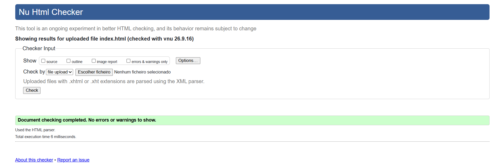 | 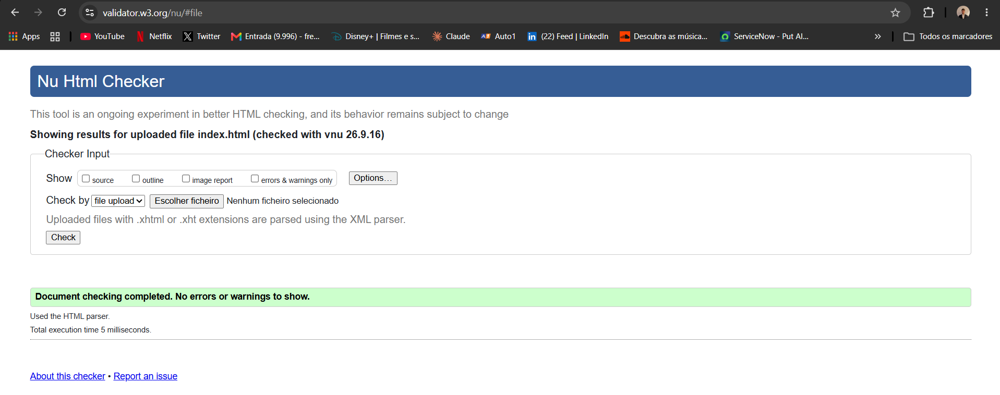 |

---

## O que aprendi

**Planear antes de programar.** Tirei o conteúdo do CV para um ficheiro de texto e fiz esboços antes de escrever HTML. Quando cheguei ao código, já não tinha decisões para tomar — era só transcrever. Na versão 2 fiz o mesmo: comparei três paletas e vi um protótipo antes de mexer no CSS. A parte mais demorada de um site não é escrever o código, é saber o que se quer.

**HTML semântico faz diferença.** `article`, `section` e `address` pareciam só nomes diferentes para um `div`. Mas o validador, os leitores de ecrã e os meus próprios seletores (`#experiencia ul`, `.cartao a`) dependem deles. Regra que fiquei a usar: se faz sentido sozinho é `article`, se é uma parte com título é `section`, se é só uma caixa para o CSS é `div`.

**A cascata explica quase todos os "não pega".** A maioria dos meus erros de CSS não eram de sintaxe — eram duas regras a disputar a mesma propriedade. Aprendi a verificar três coisas: a especificidade (`.menu a` ganha a `a`, um id ganha a qualquer classe), a ordem no ficheiro (entre iguais ganha a que vem depois, por isso a media query é o último bloco) e a ordem dentro da regra (`border` antes de `border-left`). Foi por isto que organizei o `style.css` do geral para o específico como se fosse um funil.

**Flex para uma dimensão, Grid para duas.** Na versão 2 tirei o Grid do `body` — em coluna única os blocos empilham-se sozinhos — e passei-o para dentro das secções: título à esquerda e data à direita (`1fr auto`), formação em 2×2, cartões com `auto-fit`. O Flex ficou onde só há uma fila ou uma coluna: header, menu, pílulas. Uma classe de layout (`grelha-2`) serve dois sítios diferentes.

**Variáveis dão nome às decisões.** Todas as cores estão em `:root`; mudar a paleta foi mudar sete linhas. Mas o ganho maior foi ter de dar nome a cada cor: `--cor-sobre-destaque` existe porque no hover o texto tem de se ler em cima do bronze — antes isso era um `#ffffff` perdido no ficheiro. E percebi que contraste se mede: o castanho que queria como texto sobre marinho não chegava a 3:1, por isso ficou como cor de destaque.

**Responsivo é só o que muda.** A media query não repete o CSS — tem seis ou sete linhas com o que é diferente no telemóvel (foto mais pequena, data por baixo do título, grelhas a uma coluna). O resto é herdado. Como o layout da versão 2 já é vertical, precisou de menos media query do que a versão 1.

**Branches dão liberdade.** Sete pull requests, e o `main` nunca recebeu código sem merge. Refiz o header, apaguei a lateral e troquei a paleta numa branch enquanto a versão 1 continuava no ar. Ler o diff antes do merge apanhou erros que eu não tinha visto no editor. Os prefixos nos commits (`feat:`, `style:`, `docs:`, `fix:`) fazem o `git log` contar as fases do projeto.

**Cache engana.** Depois do merge, o site mostrava o CSS novo com o HTML antigo. O servidor estava certo; o browser é que reaproveitava ficheiros guardados. Agora verifico o deploy em janela anónima antes de assumir que algo está partido.

---

## Dificuldades e como as resolvi

**OneDrive e VS Code a bloquear ficheiros.** Ao mover e apagar pastas aparecia "Device or resource busy". Fechar o VS Code e pausar o OneDrive antes de operações no Git resolveu. Para o próximo projeto, o repositório fica fora do OneDrive.

**Repositório dentro de repositório.** Clonei para dentro de uma pasta que já era um repositório. Percebi a diferença entre `git init` (nasce local) e `git clone` (nasce do GitHub) e refiz a pasta.

**Âncoras do menu sem funcionar.** Faltava o `#` no `href` e havia ids com acentos. Ids são identificadores técnicos: sem acentos, sem espaços.

**`class="Contactos rapidos"`.** Um espaço numa classe são duas classes. Passou a `contactos-rapidos`.

**`a [target]` com espaço.** O espaço é o combinador descendente — o seletor procurava um elemento com `target` *dentro* do `a`. Sem espaço, `a[target]`.

**Um `;` a faltar.** A declaração seguinte era engolida e a regra "não pegava", sem nenhum erro visível. Agora, quando algo não pega, a primeira coisa que verifico é o `;` da linha anterior.

**Menu fixo a tapar os títulos.** Com `position: sticky`, ao clicar no menu o título ficava por baixo dele. `scroll-margin-top` nas secções resolveu — 72px no desktop, 112px no telemóvel, onde o menu ocupa duas linhas.

**Site "meio antigo" depois do deploy.** Cache do browser. O servidor já tinha a versão nova; `Ctrl+Shift+R` ou janela anónima mostram o que qualquer pessoa vê.

---

## Estrutura do repositório

```
CV-FRED/
├── index.html            # a página
├── style.css             # todo o CSS, comentado linha a linha
├── conteudo.md           # o conteúdo do CV em texto, base do HTML
├── imagens/
│   ├── foto.jpg
│   └── favicon.svg
├── docs/
│   ├── esboco-desktop.png · esboco-mobile.png          # fase 1
│   ├── stitch-desktop.png · stitch-mobile.png          # fase 1
│   ├── planeamento-v2.md                               # fase 4
│   ├── esboco-v2-desktop.png · esboco-v2-mobile.png    # fase 4
│   ├── stitch-v2-desktop.png · stitch-v2-mobile.png    # fase 4
│   ├── validacao-html.png · validacao-html-melhorias.png
│   ├── site-versao-1.png · site-versao-2.png
│   └── cv-frederico-busich.pdf                         # o CV para descarregar
└── README.md
```

---